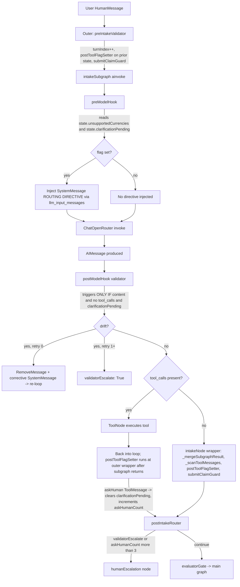

## Symptoms (from live UAT logs)

- **VND session (claim `8ff626a3`):** 5 policy-exception assistant messages, **0 askHuman tool_calls** across the entire session. Every "Please provide a brief justification to proceed, or say 'cancel'…" arrived as plain `AIMessage.content` with `tool_calls=[]`.
- User-supplied justification (twice) → agent repeated the policy question verbatim on the next turn.
- On "cancel" → agent hallucinated submission; `submitClaimGuard` rewrote output to canonical retry.
- **Contrast — German session (claim `d6ab0ed2`):** agent *did* call askHuman once (team-meal clarification) → interrupt fired, resume worked, submission succeeded.
- **Conclusion from live traces:** LLM's obedience to "every question = askHuman" is *inconsistent*. Pure prompt-based steering is unreliable for the policy-exception turn shape.

---

## 1. Current flow (message lifecycle)

Key wiring observations:

| Component | File | Trigger condition |
|-----------|------|-------------------|
| `preModelHook` directive for askHuman | `hooks/preModelHook.py` L61-71 | `state.clarificationPending == True` |
| `postModelHook` drift rewrite | `hooks/postModelHook.py` L66 | `hasContent AND not hasToolCalls AND clarificationPending` |
| `postToolFlagSetter` sets `clarificationPending = True` | `hooks/postToolFlagSetter.py` L115-120 | **Only** when `convertCurrency` returns `{supported: false}` |
| `postToolFlagSetter` clears `clarificationPending` | `postToolFlagSetter.py` L134-140 | On **any** `askHuman` ToolMessage when flag was True |
| `submitClaimGuard` | `hooks/submitClaimGuard.py` | Submission-success regex without matching submitClaim tool_call+ToolMessage |

---

## 2. Failure trace — VND policy-exception turn

Tick-by-tick trace of the failing VND session policy-exception turn (agent message #2 → user justification → agent message #3 repeats question):

**T0 — User uploads VND receipt**

- `preModelHook`: `unsupportedCurrencies=∅`, `clarificationPending=False` → **no directive injected**.
- LLM calls `extractReceiptFields`, then `convertCurrency(amount, "VND")`.
- `convertCurrency` ToolMessage: `{supported: false, currency: "VND", error: "unsupported"}`.

**T1 — Subgraph returns, outer wrapper runs postToolFlagSetter**

- Sees `convertCurrency {supported: false}` → sets `unsupportedCurrencies = {"VND"}`, `clarificationPending = True`. ✓ (Works as designed for currency.)

**T2 — Next LLM turn (still in Phase 1, manual-rate flow)**

- `preModelHook`: `clarificationPending=True` + `unsupportedCurrencies={"VND"}` → injects *two* directives: "VND unsupported, use askHuman for manual rate" and "Clarification pending, must call askHuman".
- LLM obeys → calls `askHuman("What's the VND→SGD rate?")`. Interrupt fires.

**T3 — User provides rate, graph resumes**

- `askHuman` ToolMessage recorded → `postToolFlagSetter` clears `clarificationPending = False`, `askHumanCount = 1`.
- LLM proceeds into Phase 1 step 7-9, calls `askHuman("Do the details above look correct?")` → second askHuman. User confirms.

**T4 — Phase 2 entry: searchPolicies**

- LLM calls `searchPolicies(category="meals", amount=...)` → ToolMessage returns policy excerpts.
- `postToolFlagSetter` scans: `searchPolicies` is **not** in the flag-setting branches. **No state flag changes.** `clarificationPending` remains `False`.

**T5 — LLM's next assistant turn (the FAILING turn)**

- `preModelHook`: `unsupportedCurrencies={"VND"}` still set (set-union reducer, never cleared) → injects "VND unsupported" directive. `clarificationPending=False` → **does NOT inject** the "must call askHuman" directive.
- LLM receives: base prompt (v5), "VND unsupported" directive, and message history.
- LLM decides to emit a policy-exception **question** in plain text:
  `"Policy check: This exceeds the lunch cap of SGD 20.00... Please provide a brief justification to proceed, or say 'cancel'..."`
- `AIMessage.content` is non-empty; `tool_calls = []`.
- `postModelHook`: predicate is `hasContent AND not hasToolCalls AND clarificationPending`. **`clarificationPending=False` → predicate is False → validator is a no-op.**
- No rewrite, no escalation. Plain-text question flows to SSE and renders in UI.

**T6 — User replies with justification**

- New HumanMessage entered.
- `preIntakeValidator` → `postToolFlagSetter`: no new ToolMessages (trailing run is empty because the last message is HumanMessage). **No flag changes.**
- `preModelHook`: still `clarificationPending=False` → no askHuman directive.
- LLM sees: history, original policy excerpts, user's justification. v5 Phase 2 step 6 says "treat reply as justification, proceed to submit". But LLM has no memory of whether its previous plain-text question counts as an askHuman turn, and the `searchPolicies` excerpts still look "live" in context → LLM re-emits the same policy-check narrative + re-asks for justification.
- Again `content + no tool_calls + clarificationPending=False` → postModelHook no-op. Loop.

**T7 — User types "cancel"**

- Same flag state. `preModelHook` no directive.
- LLM emits submission-success language (hallucinated) → `submitClaimGuard` catches `/claim has been submitted/` pattern → `validatorEscalate=True`. Outer router sends to `humanEscalation`.

**Net:** the defence-in-depth layers (directive injection + postModelHook validator) are both *gated on* `clarificationPending==True`, but that flag is only raised by `convertCurrency {supported:false}`. **There is no flag-setting pathway for `searchPolicies` → policy violation detected.** The policy-exception path is effectively defenceless; only the prompt is telling the LLM to use askHuman, and the LLM sporadically ignores it.

---

## 3. Root cause ranking

### (a) PRIMARY — State-flag pathway missing for policy-violation turns

**Evidence:**
- `postToolFlagSetter` L115-120: sets `clarificationPending` **only** on `convertCurrency {supported:false}`.
- `searchPolicies` branch (`_scanToolMessages` in `node.py` L328-351) populates `state.violations` but does **not** touch `clarificationPending`.
- `preModelHook` L61-71 only injects the askHuman directive when `clarificationPending==True`.
- `postModelHook` L66 drift predicate requires `clarificationPending==True`.
- Consequence: on a turn where the LLM has just read policy excerpts and is about to ask for justification, **no state flag is set, no directive is injected, and the validator is dormant**. The prompt is the sole enforcement — and the live UAT proves it's unreliable (VND session: 0/5 askHuman calls on this turn shape).

**Why 13-12 F1 is vacuous here:** F1 clears `clarificationPending` on an askHuman ToolMessage. But `clarificationPending` was never *set* for the policy-exception path, so there is nothing to clear. The fix protects only the `convertCurrency` → manual-rate sub-flow.

### (b) SECONDARY — postModelHook drift predicate can't catch this pattern

Even if the LLM emits a question-shaped plain-content AIMessage, `postModelHook` won't rewrite it unless `clarificationPending` is already `True`. The validator is reactive to an existing pending state, not proactive about question-shaped content. Fixing (a) effectively fixes (b) because setting the flag would make the validator active on the very next drift.

Ranking: **(a) dominates.** (b) is a direct downstream effect of (a). Option (c) (tool_choice="required") is an alternative enforcement layer but orthogonal to the state-flag gap.

---

## 4. Proposed fix options

### Option A — `postToolFlagSetter` sets `clarificationPending=True` on `searchPolicies` with violation

**Mechanism:** extend `postToolFlagSetter.py` to detect `searchPolicies` ToolMessages whose parsed content signals a violation (e.g. numeric-threshold breach encoded into the tool's return contract, or a new field `violationDetected: True`). When present, set `clarificationPending=True`. This flips both defence layers on automatically for the next LLM turn.

**Files:** `hooks/postToolFlagSetter.py` (add branch), possibly `tools/searchPolicies.py` (extend return contract with an explicit `violationDetected` flag so the flag-setter isn't doing semantic inference on excerpts).

**Pros:** minimal surface, reuses every existing mechanism, tests composable. Addresses the primary root cause directly.

**Cons:** requires `searchPolicies` to return a structured violation signal, which currently it doesn't (tool returns raw excerpts + scores). Semantic "is this a violation?" decision still lives in the LLM — flag-setter can't detect it from excerpts alone without the tool contract change.

---

### Option B — `postModelHook` adds question-shape predicate independent of `clarificationPending`

**Mechanism:** widen drift predicate to: `hasContent AND not hasToolCalls AND (clarificationPending OR questionShape(content))` where `questionShape` = content ends with `?` OR contains keywords `"justification"`, `"provide"`, `"proceed"`, `"say 'cancel'"`, etc. On match, soft-rewrite to corrective SystemMessage (same as existing path).

**Files:** `hooks/postModelHook.py` (single predicate widening).

**Pros:** one-file change, no tool contract change, catches plain-text questions universally, not just policy-exception.

**Cons:** regex-based detection is fragile (false positives: the LLM might produce legitimate informational sentences with `?`); increases validator retry cost on every `?`-containing response; still retries through the LLM which may drift again (the retry path depends on the LLM being willing to re-emit as askHuman, same failure mode).

---

### Option C — Code-enforced `justificationGate` node after policy-violation detection

**Mechanism:** after the intake subgraph returns, if `state.violations` contains entries indicating threshold breach AND `state.intakeFindings.justification` is null, route to a new `justificationGate` node that:
1. Inspects the most recent HumanMessage for cancel keyword → route to cancel handler.
2. Inspects for non-empty user text → treat as justification; set `intakeFindings.justification`, signal to advance to submitClaim.
3. Otherwise → emit a canonical askHuman via an AIMessage with an explicit `askHuman` tool_call *constructed in code* (not LLM-generated).

**Files:** `agents/intake/nodes/justificationGate.py` (new), `core/graph.py` or `agents/intake/node.py` (wire conditional edge), `tools/searchPolicies.py` (return structured violation signal).

**Pros:** removes the LLM from the cancel/justification decision entirely — fixes Gap 4 and Gap 5 with one mechanism. Highest determinism.

**Cons:** large surface area (new node, new edges, new state semantics); duplicates prompt Phase 2 step 6 logic in code; constructing a synthetic askHuman tool_call from a non-LLM node is fiddly (must match the tool_call id plumbing create_react_agent expects).

---

### Option D — LLM `tool_choice` forcing on policy-exception turns

**Mechanism:** when `preModelHook` detects policy-violation state, bind the LLM for *this call only* with `tool_choice={"type":"function","function":{"name":"askHuman"}}` so the OpenRouter provider forces the model to emit an askHuman tool_call.

**Files:** `hooks/preModelHook.py` plus `agents/intake/node.py` (requires injecting bound-LLM handle into the subgraph call, which `create_react_agent` doesn't expose cleanly — may require a custom model node wrapper instead of the prebuilt).

**Pros:** strongest provider-side enforcement.

**Cons:** highest code-surface cost; `create_react_agent` prebuilt doesn't expose per-call `tool_choice` mutation; would likely require abandoning the prebuilt or maintaining a custom fork of the loop. Also: `tool_choice="required"` on OpenRouter is provider-dependent; some models don't honour it consistently. Brittle.

---

## 5. Recommendation

**Pick Option A, with a minimal contract tweak to `searchPolicies`.**

**Rationale:**
1. **Minimal surface.** Two files: `tools/searchPolicies.py` (return contract) and `hooks/postToolFlagSetter.py` (new branch). No new nodes, no graph rewiring, no prebuilt abandonment.
2. **Reuses every existing mechanism.** The whole Phase 13 architecture is "state flags drive defence-in-depth" — preModelHook directive, postModelHook validator, 1-retry rewrite, escalation on second drift. Option A just plugs the missing input signal into that pipeline. 13-12 F1 (clear-on-askHuman) then becomes meaningful for this path: once the violation sets `clarificationPending=True`, the LLM is forced to askHuman, the askHuman ToolMessage clears it, and v5 Phase 2 step 6 flow resumes.
3. **Composability.** If Option A is not enough in the wild (e.g. the LLM still occasionally ignores a directive even when injected), Option B's question-shape predicate can be added as a later belt-and-braces layer — they don't conflict.
4. **Consistency.** `convertCurrency {supported:false}` already follows this pattern (structured-return → flag-setter → directive). Policy-violation should work identically; it's a missing symmetry, not a design change.

**Out of scope for Option A (tracked separately):**
- Gap 5 (cancel keyword) needs a code-side HumanMessage inspector — Option C's step 1 is the minimal fix for that and should be scoped as a follow-up plan. Not bundled here to keep Option A surgical.
- Option B's `questionShape` predicate can be deferred until Option A is measured in live UAT; may not be needed.

**Files that would change for Option A (1–3):**
1. `src/agentic_claims/agents/intake/tools/searchPolicies.py` — extend return contract with `violationDetected: bool` (and ideally `violationSummary: str | None`) so the MCP tool reports compliance decision, not raw excerpts only.
2. `src/agentic_claims/agents/intake/hooks/postToolFlagSetter.py` — add a `searchPolicies` branch: when `violationDetected==True`, set `clarificationPending=True`. Mirrors the existing `convertCurrency` branch structurally.
3. *(Optional, tests)* `tests/test_intake_hooks.py` or equivalent — add coverage for the new flag-setter branch and for the end-to-end "violation → directive injected → askHuman called" path using the existing hook-unit-test scaffolding.

If the `searchPolicies` tool cannot be changed to report compliance (e.g. it's a pure RAG retriever by design and the compliance decision is LLM-owned), the fallback is: have `postToolFlagSetter` trigger on the *presence of violation excerpts* in state (set `clarificationPending=True` whenever `_scanToolMessages` has populated `state.violations` with at least one result and no justification is recorded). That moves the change from the tool boundary into `node.py` and `postToolFlagSetter.py` only — still within the 1-3 file budget.

---

## Summary

The policy-exception plain-text bypass is not a prompt problem and not an LLM alignment problem. It is a **missing state-flag edge**: the two layers of defence (`preModelHook` directive + `postModelHook` validator) are both gated on `clarificationPending==True`, and that flag is only raised by `convertCurrency`, never by policy violations. Wire `searchPolicies`-triggered violations into the same flag pathway (Option A), and every existing Phase 13 mechanism starts working for this path. The 13-12 F1 clear-on-askHuman fix becomes non-vacuous as a side effect. Gap 5 (cancel keyword) is a related but separate defect that should be handled by a dedicated HumanMessage pre-check (a subset of Option C), not bundled into this fix.
